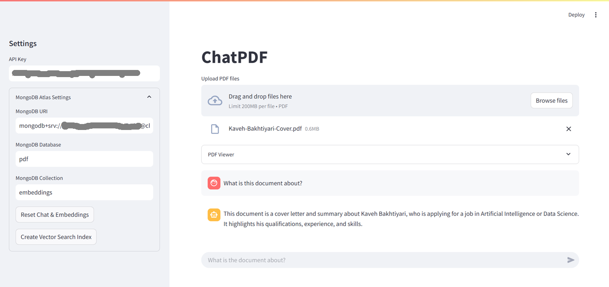

# ChatPDF with Google Gemini

A RAG to chat with multiple PDF files using Google Gemini LLM.

# Requirements

The following components are required to run ChatPDF application.

## Google Gemini API
You need to get an API key from Gemini. Google also provides free API keys.

## MongoDB Atlas
We are storing the embeddings in MongoDB to perform Vector Search. This feature is available on cloud-based version of MongoDB, aka. MongoDB Atlas. You can create a free account on its website.

- [Register for a free MongoDB Atlas Account](https://www.mongodb.com/cloud/atlas/register?utm_campaign=devrel&utm_source=workshop&utm_medium=organic_social&utm_content=rag%20to%20agents%20notebook&utm_term=richmond.alake)
- [Create a Cluster](https://www.mongodb.com/docs/guides/atlas/cluster/)
- [Get your connection string](https://www.mongodb.com/docs/guides/atlas/connection-string/)

### Vector Search Index
Once a cluster is created on MongoDB Atlas, go ahead to create a database and a collection.
A vector search index with the following format should be created on the created collection.

```json
"fields": [
  {
      "type": "vector",
      "numDimensions": 768,
      "path": "embedding",
      "similarity":  "cosine"
  },
  {
      "type": "filter",
      "path": "file_name"
  }
  ]
```

- [Create an Atlas Vector Search Index](https://www.mongodb.com/docs/compass/current/indexes/create-vector-search-index/)


## Streamlit Secrets

A Streamlit secrets file should be created in `.streamlit/secrets.toml` with the following format, providing the details of the API key and MongoDB settings:

```toml
[Gemini]
GEMINI_API_KEY = "api_key_here"
LLM_MODEL = "gemini-2.0-flash"
EMBED_MODEL = "models/text-embedding-004"

[MongoDB]
URI = "mongodb+srv://<username>:<password>@<cluster_name>.qwar6.mongodb.net/"
DB = "pdf"
COLLECTION = "embeddings"
```

## Run
In order to run this tool, you must have Streamlit installed on your machine/environment:

    streamlit run app.py

## Github Repo
This project is open-source, and it is available on Github at [https://github.com/kavehbc/chat-pdf](https://github.com/kavehbc/chat-pdf).

## Screenshot


## Developer(s)
Kaveh Bakhtiyari - [Website](http://bakhtiyari.com) | [Medium](https://medium.com/@bakhtiyari)
  | [LinkedIn](https://www.linkedin.com/in/bakhtiyari) | [GitHub](https://github.com/kavehbc)

## Contribution
Feel free to join the open-source community and contribute to this repository.
